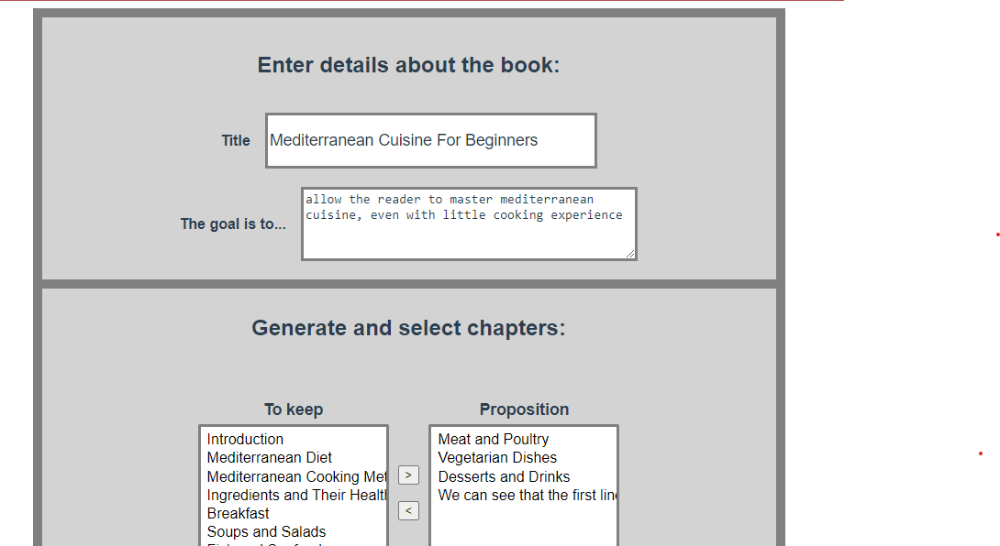

# threadwriter
A simple web interface that allows users to leverage the text completion capabilities of GPT-3 in order to generate a complete given only a title and a short summary of the book.
To do so, the book in built in a hierarchical manner:
First, we generate the chapters of the book
For each chapter, we generate the sections
The sections are then developed into multiple key points
It is those key points that are finally used to generate the full paragraphs of the book.



In order use of this project, don't forget to add you OpenAI API key at the root of the project in the file ".env", containing the following line:
VUE_APP_OPENAI_API_KEY='sk-rcz....'

## Project setup
```
npm install
```

### Compiles and hot-reloads for development
```
npm run serve
```

### Compiles and minifies for production
```
npm run build
```

### Lints and fixes files
```
npm run lint
```
